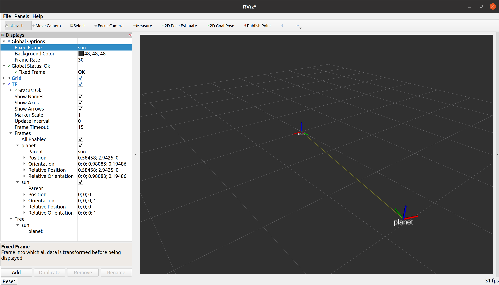
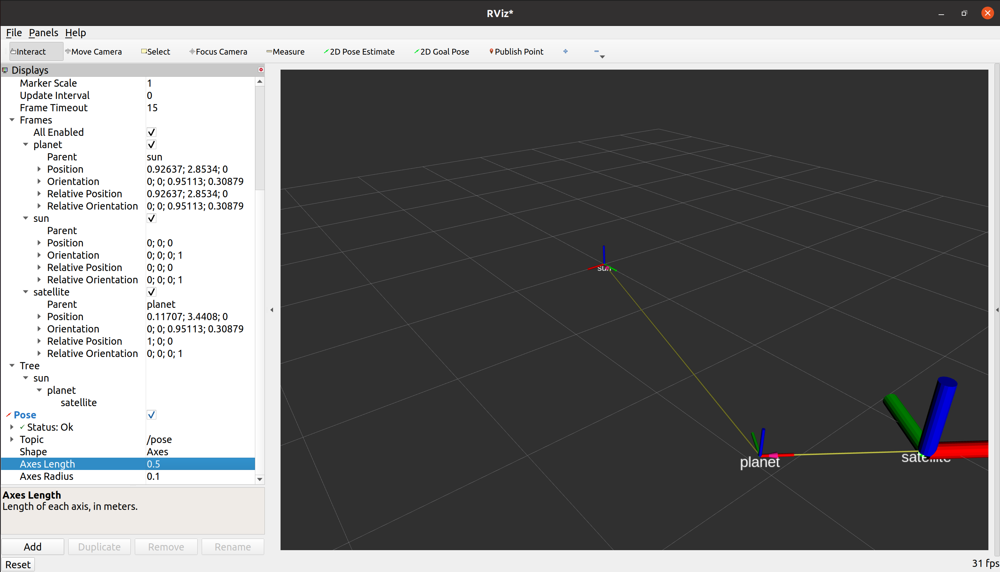
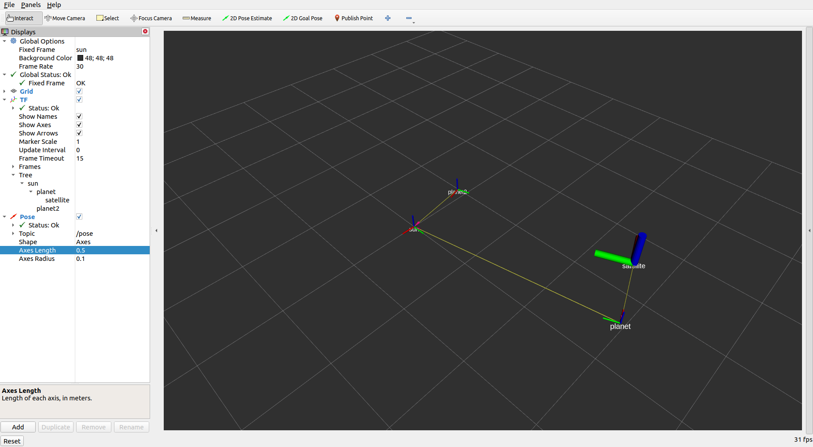
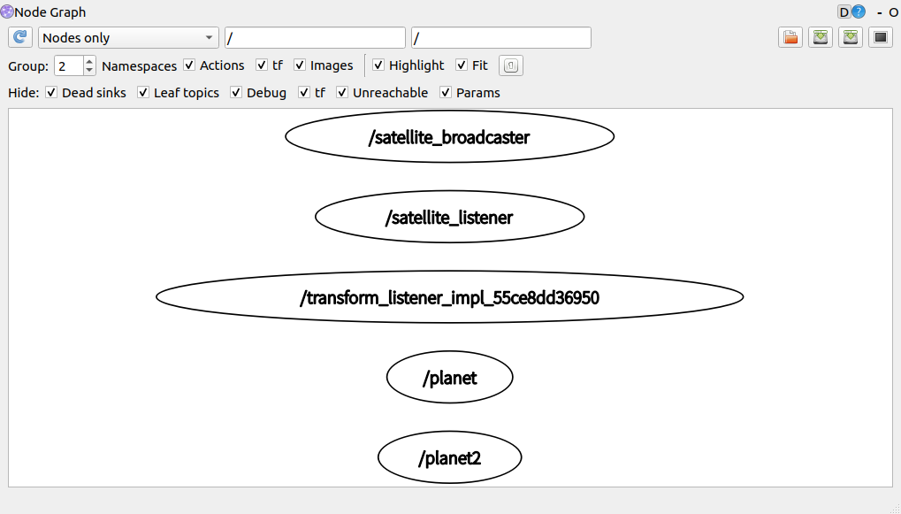
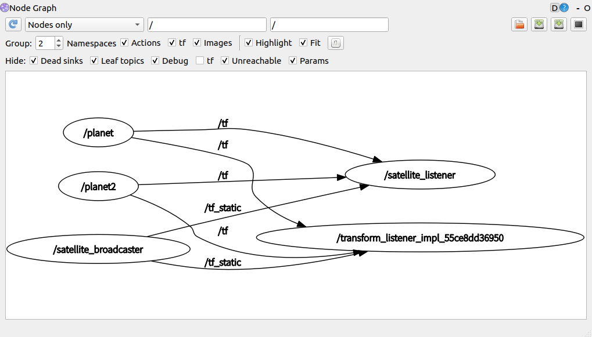
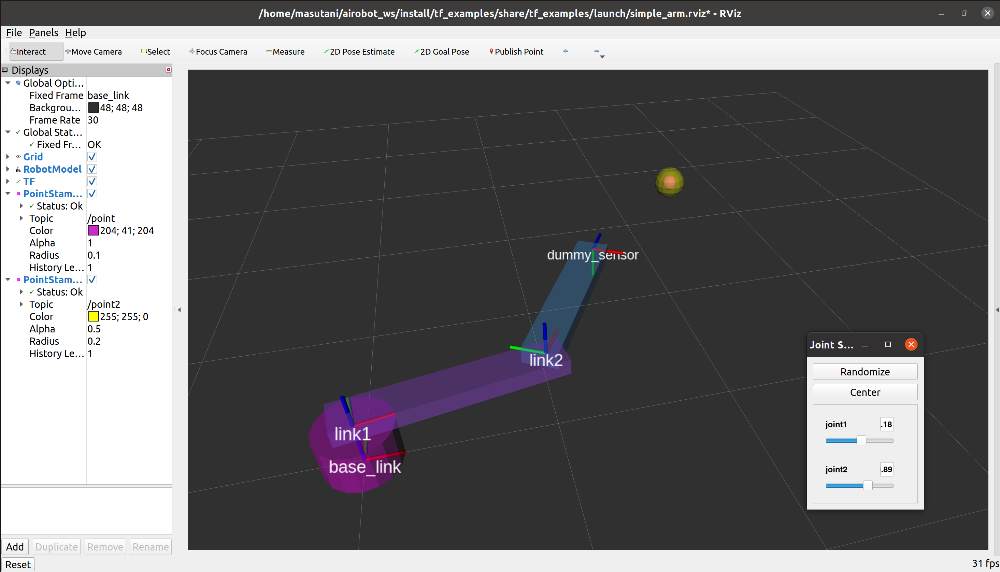

# TFの説明のための例プログラム 

升谷 保博  
2022年7月  

## 概要

- PythonでROS2のTF（TF2）を扱うための例プログラム．
- Ubuntu 20.04, ROS Foxyで作成・確認

## インストール

- このパッケージとsimple_armを含むリポジトリを入手．

- パッケージのビルド．
  ```
  sudo apt install ros-foxy-tf-transformations
  pip3 install transforms3d
  cd ~/airobot_ws
  colcon build --packages-select simple_arm tf_examples
  ```

## 使い方

### TFのブロードキャスタ・リスナの単純な例

- RVizの使い方を学び，ノードの設定を変更して起動し直すので，ローンチは使わない．
- 以下で使う端末では，次のコマンドを実行済みとする．
  ```
  source ~/airobot_ws/install/setup.bash
  ```
- 端末1
  ```
  ros2 run tf_examples planet_broadcaster
  ```
  - 座標系 `sun`に対して公転と自転をする座標系 `planet` をブロードキャストする．
  - [Pythonスクリプト](tf_examples/planet_broadcaster.py)

- 端末2
  - RVizの過去の設定を削除
    ```
    rm ~/.rviz2/default.rviz
    ```
  - RVizを起動
    ```
    rviz2
    ```
  - Global Options → Fixed Frame を `sun` に設定．
  - Addボタンをクリック．現れたウィンドウのBy display typeの一覧の中から *TF* を選んで，OKをクリック

  

- 端末3
  ```
  ros2 run tf_examples satellite_broadcaster
  ```
  - 座標系 `planet`に対して固定された座標系 `satellite` を静的ブロードキャストする．
  - [Pythonスクリプト](tf_examples/satellite_broadcaster.py)
- RViz
  - Displaysパネル内の *TF* 項目を展開．TFの情報が得られることを確認する．
    - Show Nmaes にチェックを入れると，TFの名前が表示される．
    - Framesの下には，座標系ごとの情報が表示される．
    - Treeの下には座標系の親子関係が示される．

  

- 端末4
  ```
  ros2 run tf_examples satellite_listener
  ```
  - tfをリッスンして，座標系`satellite`から座標系`sun`への変換を取得し，その結果をPoseStampedとしてパブリッシュする．
  - [Pythonスクリプト](tf_examples/satellite_listener.py)
- RViz
  - Addボタンをクリック．現れたウィンドウのタブをBy topicに切り替え，一覧の中の`/pose`の下の *Pose* を選んで，OKをクリック
  - Displaysパネルに追加された *Pose* 項目を展開
    - ShapeをAxesに変更
    - Axes Lengthを0.5に変更

  

- 端末5
  ```
  ros2 run tf_examples planet_broadcaster planet2 1 8
  ```
  - `planet_broadcaster`の別のノードを起動する．
  - [Pythonスクリプト](tf_examples/planet_broadcaster.py)
  - ノード名，座標系名ともに`planet2`
  - 公転半径1[m]，公転周期8[s]

  

- 端末6
  - トピック
  ```
  ros2 topic list
  ros2 topic echo /tf
  ros2 topic echo /tf_static
  ros2 topic echo /pose
  ```
  （/tf_staticは何も表示されない）
  - ノードグラフ
  ```
  rqt_graph
  ```
  - Hideのtfにチェックを入れた場合と入れない場合
    - tfにチェックあり（tfの表示なし）

      

    - tfにチェックなし（tfの表示あり）

      

- 端末4
  - 実行中の`satellite_listener`をCtrl+cで終了させる．
  - 以下を実行．
    ```
    ros2 run tf_examples satellite_listener planet2
    ```
  - 基準の座標系を`sun`から`planet2`に変更．

- その他色々試す．
  - RvizのDisplaysパネルの Global Options → Fixed Frames を変更してみる．
  - 端末5で実行中の2番目の`planet_broadcaster`をCtrl+cで終了させる．
    - RVizの画面や端末4で何が起こるか観察する．
  - 端末5で異なる設定で`planet_broadcaster`を再実行．
    ```
    ros2 run tf_examples planet_broadcaster planet2 1 8 0.5
    ```
    - TFの出力周期を0.5[s]に
  - 端末1で実行中の1番目の`planet_broadcaster`をCtrl+cで終了させる．
    - RVizの画面や端末4で何が起こるか観察する．
  - 端末1で異なる設定で`planet_broadcaster`を再実行．
    ```
    ros2 run tf_examples planet_broadcaster planet 3 16 0.3
    ```
    - TFの出力周期を0.3[s]に．他の設定は規定値と同じ．

### URDFやローンチとの組み合わせ・センサデータの座標変換

  

- 上記のRViz，端末はすべて終わらせておく．
- 端末を開き，以下を実行．
  ```
  source ~/airobot_ws/install/local_setup.bash
  ros2 launch tf_examples simple_arm.launch.py
  ```
  - RVizがのウィンドウが現れ，simple_armと紫色と黄色の動く球が表示される．
    - 紫色の球： `/point`トピック．アームの手先に取り付けられたダミーの3次元センサの出力．
    - 黄色の球： `/point2`トピック．`/point`トピックの座標系を座標系`base_link`に変換したもの．
  - `joint_state_publisher_gui`のウインドウが現れ，スライダでsimple_armを操作できる．
- 端末2
  ```
  rqt_graph
  ```
  - Hideのtfにチェックを入れた場合と入れない場合
- [ローンチファイル](launch/simple_arm.launch.py)から実行されているノード
  - `robot_state_publisher`
    - [simple_arm](https://github.com/AI-Robot-Book/chapter6/tree/master/simple_arm)パッケージで提供されているURDFを読み込んで，`/robot_description`，`/tf`，`/tf_static`などのトピックをパブリッシュする．
  - `joint_state_publisher_gui`
    - スライダで入力された値を`/joint_states`トピックへパブリッシュする．
  - RViz
    - このパッケージで提供する[Configファイル](launch/simple_arm.rviz)に応じて表示
  - `static_transform_publisher`
    - `link2`に取り付けられた`dummy_sensor`の座標系の位置姿勢をブロードキャスト
  - `dummy_sensor_publisher`
    - このパッケージで提供する[Pythonスクリプト](tf_examples/dummy_sensor_publisher.py)
    - 3次元の位置情報が取得できるセンサの代わりとして，円運動する点の座標に`frame_id: dummy_sensor`を添えてPointSatmped型の`/point`トピックへパブリッシュする．
  - `dummy_sensor_subscriber`
    - このパッケージで提供する[Pythonスクリプト](tf_examples/dummy_sensor_subscriber.py)
    - センサデータを想定した`/point`トピックをサブスクライブし，その座標値を座標系`base_link`に変換する．
    - 確認のため変換後の値を`frame_id: base_link`を添えてPoseSatmped型の`/point2`トピックへパブリッシュする．
    - rclpyでは，データのトピックとtfをまとめて受信するAPIままだ提供されていないようなので，データのトピックのサブスクライバのコールバックの中でtfをリッスンしている．
    - rclpyでは，データのトピックを座標変換するAPIがまだ提供されていないので，`tf_transformations`モジュールの機能を使って自前で座標変換している．

## 既知の問題

- tfに関係する操作をしているとRVizが時々落ちる．
- ROS2のPythonでは，C++の`tf2_ros::MessageFilter`に相当するものが用意されていない．また，`tf2_ros.Buffer.transform()`も使えない．
